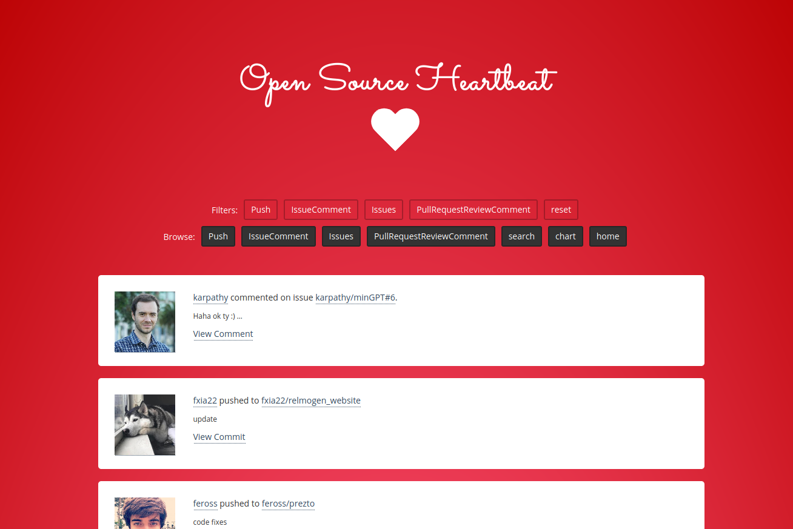

# Open Source Heartbeat Stanford

This repository will show the opensource heartbeat interface for Stanford
University. Users are found with a query for location as Stanford, along
with from a custom list of known organizations.

## How do I add myself to the repository?

If you can't be found via the query, then you can add your username to the
[users.txt](users.txt) file.

## How do I remove myself from the repository?

Add your name to the file `exclude-users.txt` to be skipped. If you already have
contributions added, please [open an issue](https://github.com/stanford-rc/opensource-stanford/issues)
to request complete removal.

## How do I generate this for my group/user base?

The GitHub Action we use is [rseng/opensource-heartbeat-action](https://github.com/rseng/opensource-heartbeat-action).
